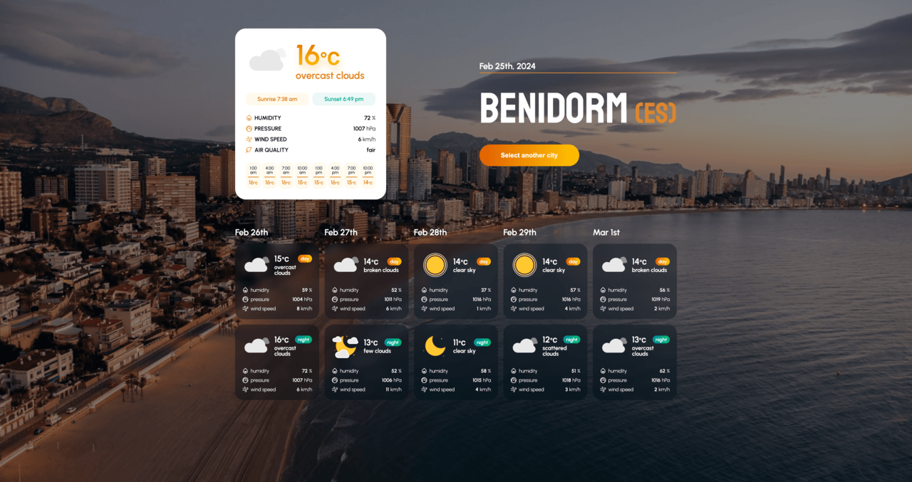
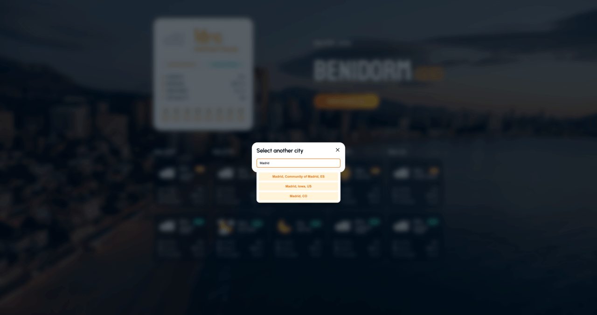
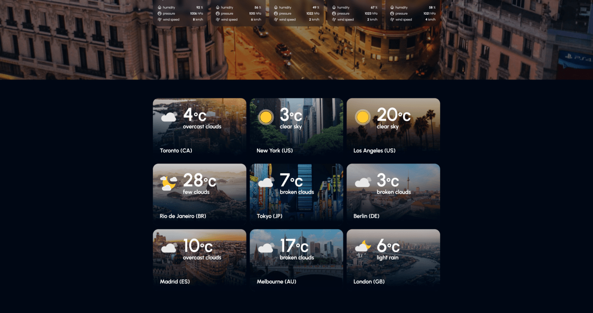

## Screenshots

## Description

A responsive weather forecast application that displays real-time weather data based on geolocation. Users can also search and switch between cities to view up-to-date weather conditions anywhere in the world.

## Link
https://weather-box.yuliia-tkachenko.dev

## Created with:
React, TypeScript, HTML, SCSS, OpenWeather API, Unsplash Image API

Designed and developed by Yuliia Tkachenko, 2024
